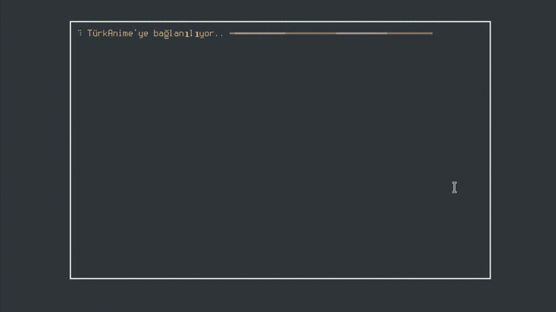

# TürkAnimu-Cli
[](https://github.com/KebabLord/turkanime-indirici/releases/latest)  [](https://github.com/kebablord/turkanime-indirici/releases/latest/download/turkanimu.exe)  [](https://github.com/KebabLord/turkanime-indirici/actions) [](https://pypi.org/project/turkanime-cli/)

Türkanime için terminal video oynatıcı ve indirici. İtinayla her bölümü indirir & oynatır.
 - Yığın bölüm indirebilir
 - Animu izleyebilir
 - Uygulama içinden arama yapabilir
 - Fansub seçtirebilir
 - Bir yandan izlerken bir yandan animeyi kaydedebilir
 - İndirmelere kaldığı yerden devam edebilir
 
#### Desteklenen kaynaklar:
```Sibnet, Odnoklassinki, Sendvid, Mail.ru, VK, Google+, Myvi, GoogleDrive, Yandisk, Vidmoly, Yourupload, Dailymotion```

#### Yenilikler:
 - Seçim ekranı en son seçilen bölümden başlıyor, https://github.com/KebabLord/turkanime-indirici/discussions/35 https://github.com/KebabLord/turkanime-indirici/discussions/30
 - Önceden indirilen veya izlenen animelere izlendi ikonu seçeneği
 - Gereksinimleri otomatik indirme sistemi basitleştirildi
 - Dosya yönetim sistemi eklendi
 - Minimalleştirmeler & Hata gidermeleri


# Kurulum
Önceden derlenmiş sürümleri [indirebilir](https://github.com/KebabLord/turkanime-indirici/releases/latest) ya da pip ile kolayca `pip install turkanime-cli` kurabilirsiniz. Pip ile kuruyorsanız, ya da scripti kaynak kodundan çalıştırıyorsanız mpv ve geckodriver'ın sisteminizde kurulu olduğundan ve sistem path'ında olduğundan emin olun. Konuya ilişkin rehber için [wiki sayfası](https://github.com/KebabLord/turkanime-indirici/wiki/Herhangi-bir-uygulamay%C4%B1-system-path'%C4%B1na-ekleme).

 ### İzleme ekranı
 

 ### İndirme ekranı
 

### Yapılacaklar:
 - Progress yaratılma satırı minimal bir class ile kısaltılacak.
 - ~~Domain güncellemesinden beridir kod stabil çalışmıyor, düzeltilecek.~~
 - ~~Kod çorba gibi, basitleştirilecek.~~
 - ~~Navigasyon  ve indirme algoritması http talepleriyle sağlanacak.~~
 - ~~Zaman bloğu olarak sleep'den kurtulunacak, elementin yüklenmesi beklenecek.~~
 - ~~Prompt kütüphanesi olarak berbat durumda olan PyInquirer'den Questionary'e geçilecek.~~
 - ~~Arama sonuçları da http talepleriyle getirilecek.~~
 - ~~Fansub seçme özelliği tekrar eklenecek.~~
